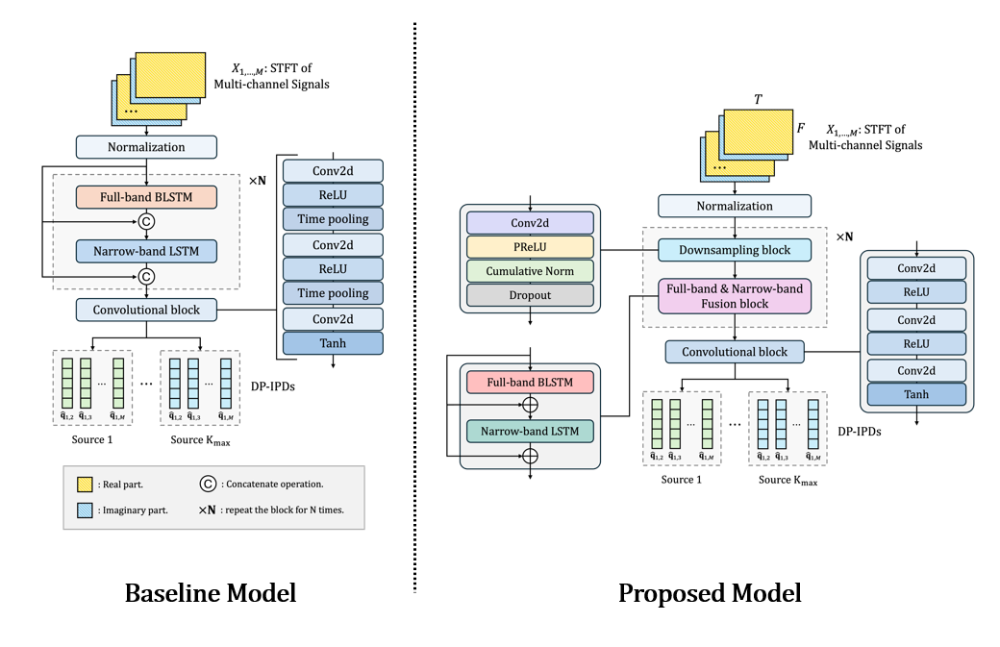

# A Lightweight Direct-Path IPD Estimation Model for Real-Time Multiple Moving Sound Source Localization
## 🔍 Overview
- This study proposes a lightweight LSTM-based neural network for localizing multiple moving sources in noisy and reverberant environment
- A full-band and narrow-band fusion network is adopted as the backbone netowrk, which has recently emerged as a prominant research trend. 
 

## 💡 Motivation
- The backbone network requires high computational complexity as each individual narrow-band layer must processes full time frames across every frequency bin, resulting in substantial computational burden.
- While the parameter size in a deep-learning model primarily affects memory usage, the actual inference time and energy consumption are more significantly influenced by computational complexity.
- Reducing computational load enhances execution speed and reduces power consumption, making the model more suitable for mobile and embedded environments.
- Therefore, this work focuses on minimizing computational complexity rather than simply reducing parameter size.
 

## ⭐ Method

- To improve computational efficiency, the model incorporates down-sampling blocks composed of convolutional layers. These progressively compress the temporal dimension while extracting compact feature representations.
- The original skip connection method based on concatenation is replaced with summation to further reduce computation.
 

## 📊 Result
| Method                                 | # Params. [M] | FLOPs [G/s] | Gross Accuracy [%] | Fine Error [°] |
|----------------------------------------|---------------|-------------|---------------------|----------------|
| Full-Narrow Block × 1                  | 0.47          | 11.88       | 88.54               | 2.34           |
| Full-Narrow Block × 2 (Baseline)       | 0.71          | 19.35       | 90.91               | **2.01**       |
| Lightweight Model                      | 1.49          | 9.4         | **91.31**           | 2.18           |

Table 1.ㅣPerformance comparison between the baseline and the lightweight model on the simulation dataset.

- Experiments show that the proposed model reduces computational cost by up to 51% compared to the baseline, while achieving comparable localization performance in terms of Gross Accuracy and Fine Error.
- The results confirm that the proposed model maintains reliable localization performance even in low-resource environments.
 

## 📝 Publication
Yuseon Choi, Hyunseung Kim, and Jongwon Shin, “A Study on Lightweight Modeling for Real-Time Multi-Moving Sound Source Localization via Direct-Path Interchannel Phase Difference Estimation,” The Korean Institute of Communications and Information Sciences (KICS) Summer Conference, June 2025.
 
 

## 📚 Reference
[1] Wang, Yabo, Bing Yang, and Xiaofei Li. "IPDnet: A universal direct-path IPD estimation network for sound source localization." IEEE/ACM Transactions on Audio, Speech, and Language Processing (2024). 
[2] Stoller, Daniel, Sebastian Ewert, and Simon Dixon. "Wave-u-net: A multi-scale neural network for end-to-end audio source separation." arXiv preprint arXiv:1806.03185 (2018). 
[3] Battula, Shanmukha Srinivas, et al. "Robust Frame-level Speaker Localization in Reverberant and Noisy Environments by Exploiting Phase Difference Losses." ICASSP 2025-2025 IEEE International Conference on Acoustics, Speech and Signal Processing (ICASSP). IEEE, 2025.
